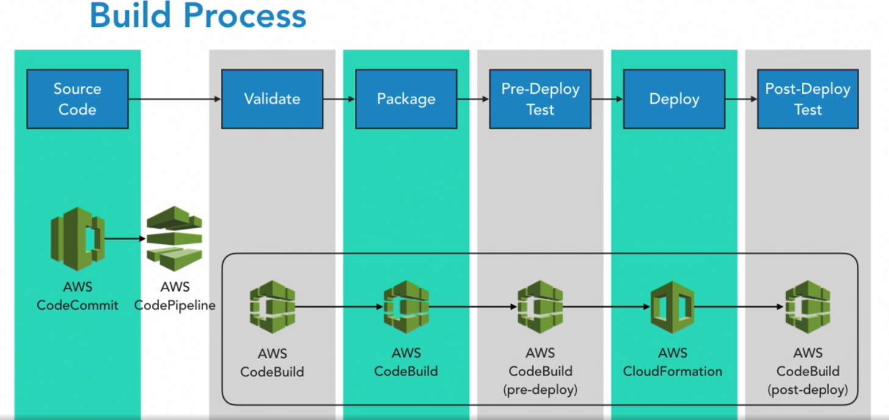
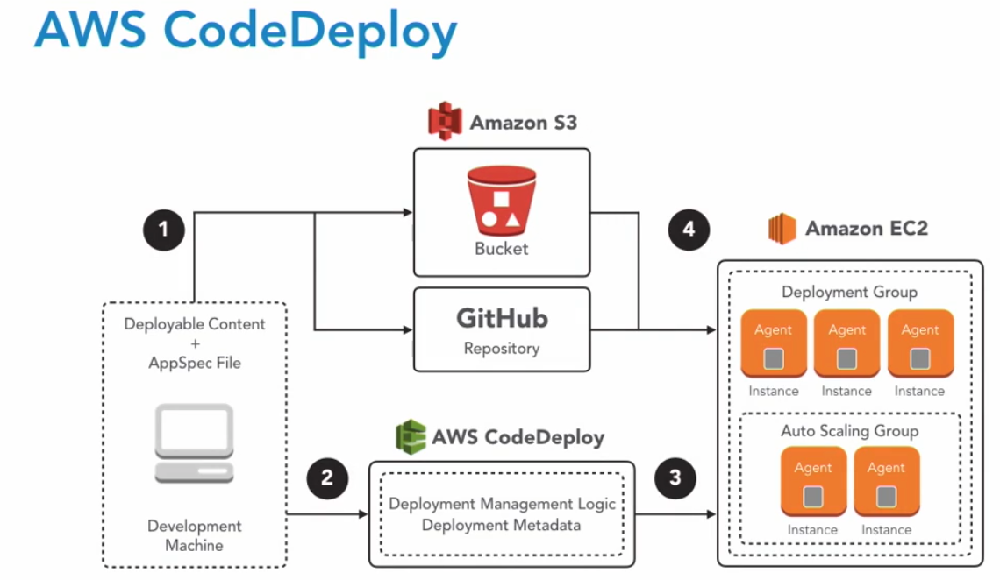

## setup aws crediential for CodeCommit
```
  aws configure
```
## Setup git
```
  git --version
  git config --global user.name  BenajminHuang
  git config --global user.email  BenajminHuangHuang@gmail.com

```

## CodeCommit
- Create repository 
  use teh master branch for deployments

- Clone the git reposotiry from  AWS


## CodeBuild
- buildspec.yml : Specify actions needed to build a project.

- Create project: 
  Set source provider and repository

- Set build environment


## CodeDeploy

